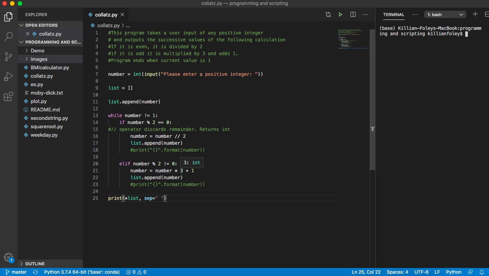
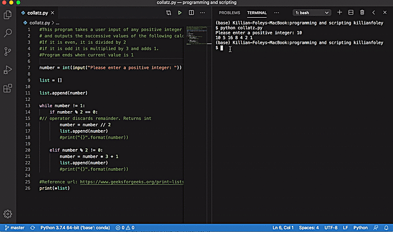
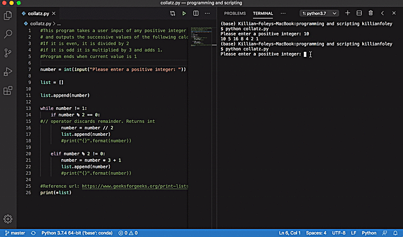

# Programming and Scripting Problem Sheet

## Introduction
The scripts located in this repository are examples of how to use various programming techniques when learning Python as part of the Programming and Scripting module for the Data Analytics course (GMIT). These techniques include if/elif statements; for/while loops; mathematical operations; reading in a file, data plotting and so on. The following README describes how the scripts were designed, researched, written and executed to arrive at the desired outcome. 

## Prerequisites
Anaconda - a data science package containing Python 3.7 and various other Python add-ons and packages was downloaded and installed for this module. https://www.anaconda.com/

Visual Studio code was used to write, edit and run the code.
 https://code.visualstudio.com/
 
 The below image is a screen shot of visual studio code. The window is split into three. The left split shows the files/ folders contined in the current directory. The middle split is where the code is written and the right split is the terminal (Mac OS) where the code is exectuded.
 
 

## Program Order & Description

### 1. BMIcalculator.py
This program requires the user to input their height and weight, returns their BMI and what category they fall in.

### 2. secondstring.py
This program reads in a string from the user and returns every second character in reverse order.

### 3. collatz.py
This program reads in a positive integer from the user and outputs successive values from the following calculations.
If the number is even divide it by 2 - return that answer
If the number is odd it is multilplied by 3 and 1 is added. 
The program ends if current value is 1.

### 4. weekday.py
This program uses the datetime module in Python to return if today is a weekday or not.

### 5. squareroot.py
This program reads in a positive floatin-point number and returns the approximate square root. "Newton's Methon" is used for the calculation. *[Wikipedia Newton's Method] https://en.wikipedia.org/wiki/Newton%27s_method*

### 6. es.py
This program reads in a text file using the filename on the command line and returns the number of "e"s in the document. 

### 7. plot.py
This program plots the functions f(x)=x, g(x)=x2, h(x)=x3 in the range [0, 4] on one set of axes.

## Running the Code
Python scripts are run on the command line. The user must first navigate to the directory containing the python program. The program is then run by typing the command 

> $ python filename.py

Any further user inputs can then be performed following prompts on the command line.

## Example
Below are 2 gifs of the collatz.py program running.
 
 

 
 

  
## Author
Killian Foley
